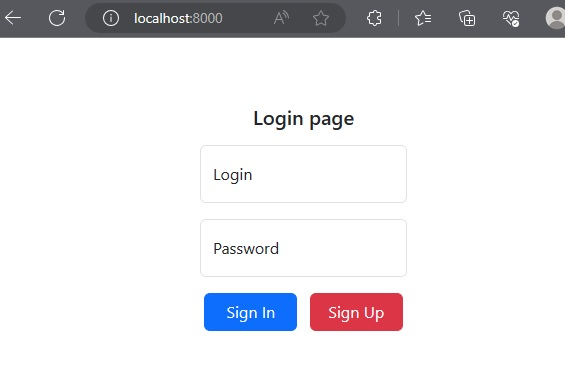
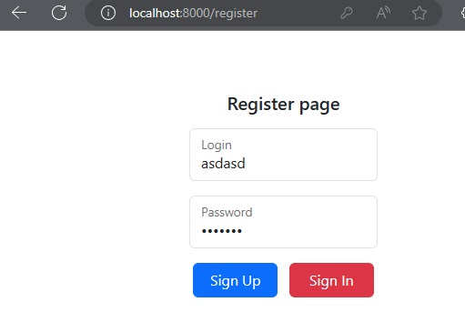
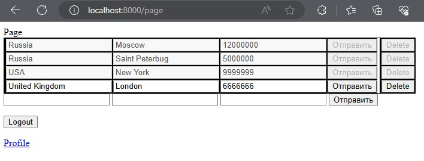
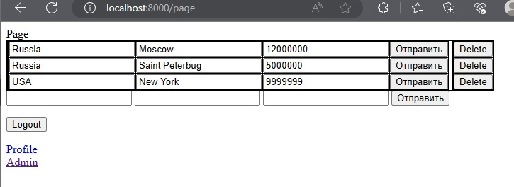
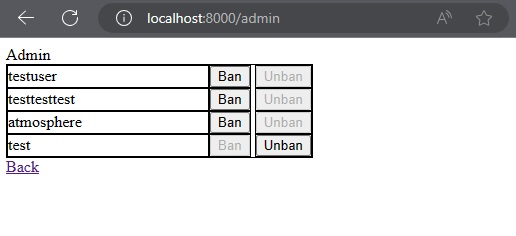

php artisan migrate:refresh --seed

restful getpostputdel
auth
routes
controllers
middleware(auth admin admin)
models (fatter) db crud
migration
seeding
blade view subview
validation

Setup developement:
	1) git clone https://github.com/atmosphere1337/crud_laravel.git
	2) cd crud_laravel
	2.1) chmod -R gu+w storage
	2.1) chmod -R guo+w storage
	3) composer install --ignore-platforms-reqs
		(could be some problems cuz you need some of php extensions installed)
	4) cp .env.example .env
	5) php artisan key:generate
	6) php artisan migrate:refresh
	7) php artisan serve
	8) http://localhost:8000/

Deploy inside Docker:
	chmod -R gu+w storage
	chmod -R guo+w storage
	sudo docker compose up -d
	http://localhost:80/

Accounts to login preset:
 --------------------------
|	login:   |  password:  |
|------------|-------------| 
|   test     |    test     |
|------------|-------------|
|   root     |    1234     |
|------------|-------------|
|   admin    |    666      |
 --------------------------
 Entities preset:
 -----------------------------------------------
|   city:   |  Country:  | Population:|  Owner: |
|-----------|------------|------------|---------|
|  Moscow   |  Russia    |     12     |  test   |
|-----------|------------|------------|---------|
|  London   |  England   |     9      |  root   |
|-----------|------------|------------|---------|
|  Paris    |  France    |     2      |  admin  |
|-----------|------------|------------|---------|
| Washington|    U.S     |    0.7     |  test   |
|-----------|------------|------------|---------|
|  Beijing  |   China    |     21     |  root   |
 -----------------------------------------------

! don't forget about a2enmod rewrite next time
